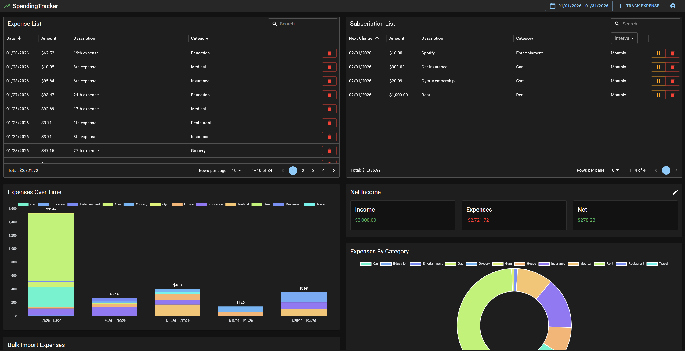

# [SpendingTracker](https://chaselane.dev/spendingtracker)

A full-stack expense and subscription tracking platform designed to surface spending insights,
trends, financial clarity.



## Features

#### Expense List

- Track date, amount, category, and receipt per expense
- View all expenses in a searchable, sortable, filterable data grid

#### Subscriptions

- Track charge interval (yearly, monthly)
- Automatically generates expenses when subscriptions are due
- Enable/disable subscriptions inline
- View upcoming charge dates

#### Analytics

- Stacked Bar Chart - Breakdown of expenses by category over time
- Donut Chart - Category breakdown of total spending
- Line Chart - Expense spending by month for the year

#### Income Tracking

- Compare total income (salary + extras) against total expenses
- View net surplus or deficit

#### Bulk Import

- Import multiple expenses at once using CSV files

#### Planned

- Bank and credit card API integrations

## Documentation

- Deployment: `docs/deployment.md`
- Development workflows: `docs/development.md`

## Dev Docker Setup

See `docs/development.md` on how to run without using Docker.

Follow these steps to run the Backend, Frontend, and PostgreSQL database locally in Docker.

The database container will automatically be seeded with dev data.

### Prerequisites

- Docker Desktop

### Setup

1.  Using `docker/env.docker.example` as a template, populate .env in the webroot

2.  Navigate to Docker dir

    ```
    cd docker
    ```

3.  Start all services

    **Note:** On first run, this will build the frontend image automatically. Subsequent runs will use the cached image.

    ```
    docker compose up -d
    ```

4.  Verify app is running (this may be a few minutes on first start)
    - **Frontend**: http://localhost:3000
    - **Backend Health Check**: http://localhost:8082/healthcheck

5.  Stop containers by running
    ```
    docker compose down
    ```

### Commands

- Build fresh images

    ```
    docker compose up --build
    ```

- Stop containers and clear all data

    ```
    docker compose down -v
    ```

- Restart the containers

    ```
    docker compose restart
    ```

- View logs from all services

    ```
    docker compose logs -f
    ```

- View logs from specific service

    ```
    docker compose logs -f pogotracker_app
    docker compose logs -f pogotracker_db
    ```

### Connecting to database

| Setting      | Value                |
| ------------ | -------------------- |
| **Host**     | `localhost`          |
| **Port**     | `5432`               |
| **Database** | `spendingtracker_db` |
| **Username** | `docker_user`        |
| **Password** | `docker1234`         |
| **Schema**   | `public`             |
