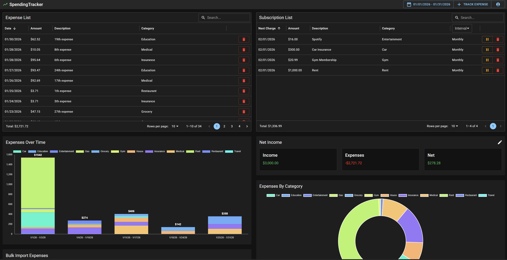

# SpendingTracker

A full-stack expense and subscription tracking platform designed to surface spending insights,
trends, financial clarity.



## Features

#### Expense List

- Track date, amount, category, and receipt per expense
- View all expenses in a searchable, sortable, filterable data grid

#### Subscriptions

- Track charge interval (yearly, monthly)
- Automatically generates expenses when subscriptions are due
- Enable/disable subscriptions inline
- View upcoming charge dates

#### Analytics

- Stacked Bar Chart - Breakdown of expenses by category over time
- Donut Chart - Category breakdown of total spending
- Line Chart - Expense spending by month for the year
- Heatmap - Showing days where the most purchases were made

#### Income Tracking

- Compare total income (salary + extras) against total expenses
- View net surplus or deficit

#### Bulk Import

- Import multiple expenses at once using CSV files

#### Planned

- Bank and credit card API integrations

## Documentation

- Deployment: `docs/deployment.md`
- Development workflows: `docs/development.md`

## Dev Docker Setup

See `docs/development.md` on how to run without using Docker.

Follow these steps to run the Backend, Frontend, and PostgreSQL database locally in Docker.

The database container will automatically be seeded with dev data.

### Prerequisites

- Docker Desktop
- Commandbox >=6.3.2
- Node >=24

### Setup

1. Configure Environment

    Copy `docker/.env.docker.example` to `backend/.env`

    ```bash
      cp backend/.env.docker.example backend/.env
    ```

    > Modify the environment variables as necessary

    > You will need to set the `JWT_SECRET` and `ENCRYPTIONKEY`

2. Start Application with Docker

    Navigate to Docker dir

    ```bash
    cd docker
    ```

    Start all services in detached mode (runs in background):

    ```bash
    docker compose up -d
    ```

    > **First run:** Docker will build the frontend and backend images automatically.

    > This may take a few minutes. Subsequent runs will use cached images and start much faster.

3. Verify the Application is

    | Service              | URL                                      |
    | -------------------- | ---------------------------------------- |
    | Frontend             | http://localhost:3000                    |
    | Backend Health Check | http://localhost:8082/api/v1/healthcheck |

4. Stop Application by running

    ```bash
    docker compose down
    ```

5. Setup GitHooks from root

    ```bash
    npm install -g lefthook
    lefthook install
    ```

6. Run the 'Post-checkout' GitHook

    ```bash
    lefthook run post-checkout
    ```

### Commands

- Build fresh images

    ```
    docker compose up --build
    ```

- Stop containers and clear all data

    ```
    docker compose down -v
    ```

- Restart the containers

    ```
    docker compose restart
    ```

- View logs from all services

    ```
    docker compose logs -f
    ```

### Connecting to the SpendingTracker database

| Setting      | Value                |
| ------------ | -------------------- |
| **Host**     | `localhost`          |
| **Port**     | `5433`               |
| **Database** | `spendingtracker_db` |
| **Username** | `docker_user`        |
| **Password** | `docker1234`         |
| **Schema**   | `public`             |
